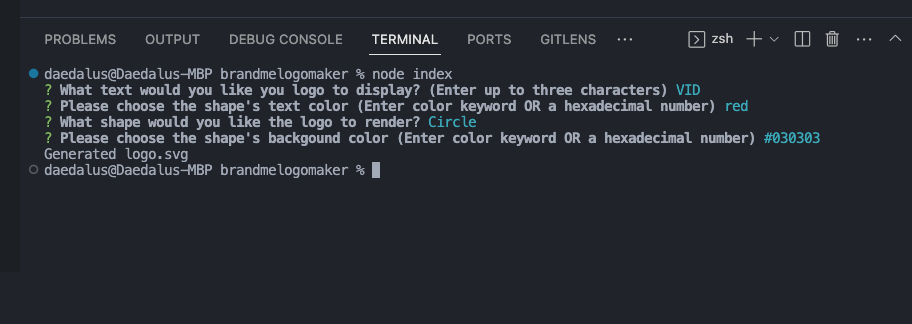

# BrandMeLogoMaker
[](https://github.com/DigitallyIntrinsic/brandmelogomaker/issues) [](https://github.com/DigitallyIntrinsic/brandmelogomaker/graphs/contributors) 

## Description
The application prompts the user to select a color and shape, provide text for the logo, and save the generated SVG to a .svg file.
          
View the deployed page at [BrandMeLogoMaker](https://github.com/DigitallyIntrinsic/brandmelogomaker).
## Contents
* [Installation](#installation)
* [Usage](#usage)
   * [Screenshots](#screenshots)
* [Built With](#built-with)
* [License](#license)
* [Contributing](#contributing)
* [Tests](#tests)
* [Questions](#questions)
* [Credits](#credits)

## Live Screen Recording Demonstration of Application

 https://drive.google.com/file/d/1wsQcM2onZcHE7V3yTU7CVw6rWWElIRl1/view

## Installation
To use this application, please install: 
```
You must install inquirer and jest in order to run this application from the command line.
```
  
## Usage
To run this application: open the application using the integrated terminal, install all dependencies (npm i), then type the command node index. Please follow the prompts to answer the questions provided. Once all questions have been answered properly, a message will display to the command line telling you your logo has been generated. Find your new logo in the newly generated SVG file. 
  
### Screenshots



## Built With

* Node.js
  
## License
This application is licensed under the MIT license.
  
## Contributing
No guidelines for collaboration, please fork and use at your pleasure. If there are any changes you think would make this better, please allow for review and merge before using again.
  
## Tests
To run tests on the application, install
```
To test this application, please run rpm run test from the terminal.
```
and run `npm run test` from the command line.
  
## Questions
If you have any questions about the repo, please [open an issue](https://github.com/DigitallyIntrinsic/brandmelogomaker/issues) or contact me via email at gitboot@1002.us. You can find more of my work on my GitHub, [DigitallyIntrinsic](https://github.com/DigitallyIntrinsic/).
  
## Credits
* [chatGPT](https://chat.openai.com/)

  
